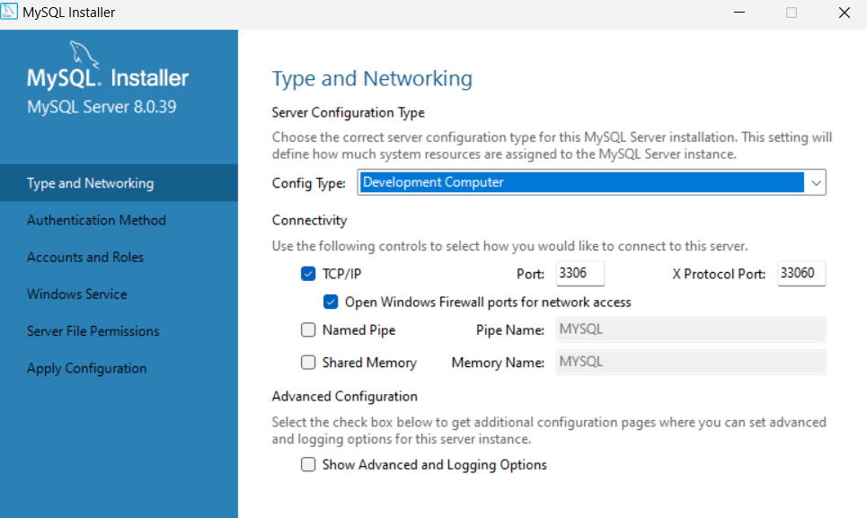
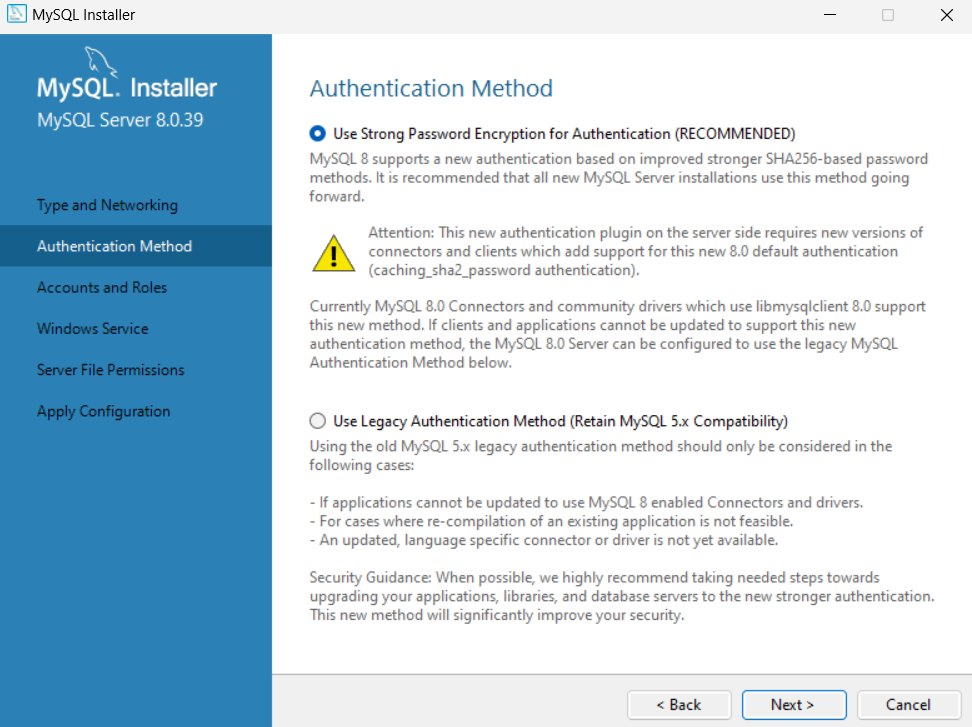
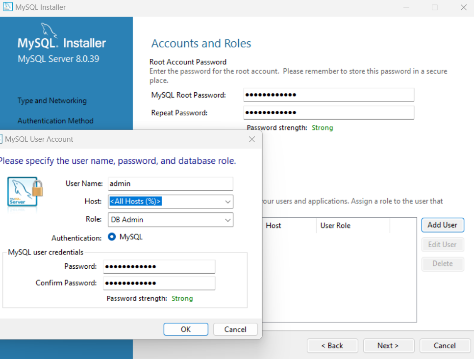
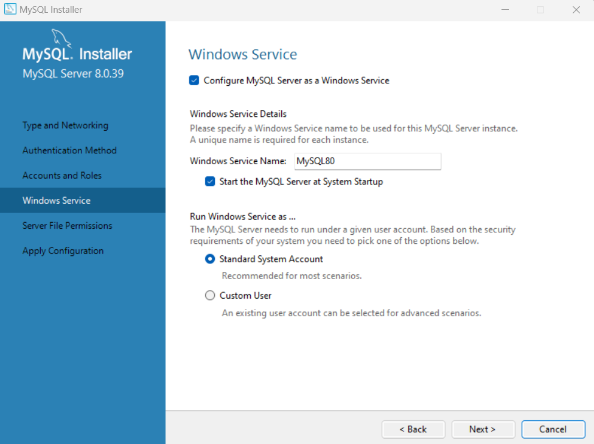
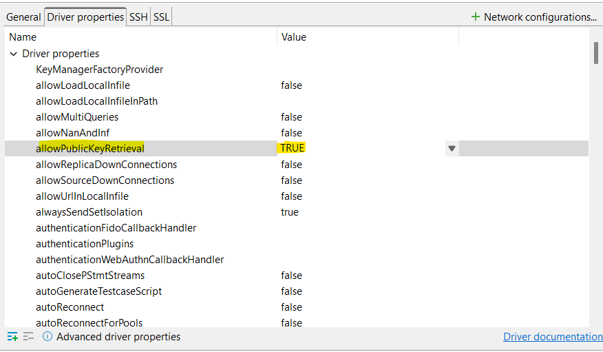
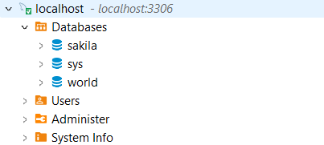
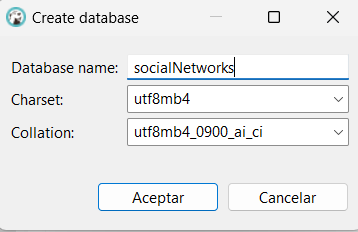
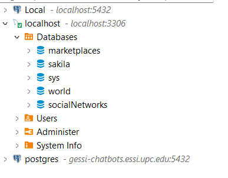

# Social Network Monitor
Project based in the Final Degree Project made by @lucasares.


---

## How to execute
### Local development
For local development you need to:

1. Install MySQL
2. Create a MySQL database
3. Fill .env with MySQL settings
4. Create and execute migrations
5. Execute django application

You can find in the following subsections the required steps for doing it.


#### MySQL installation and database creation
The step by step is done with DBeaver, but feel free to use any other software you see apropiate. 
##### 1 - Download MySQL
You can download MySQL via the [official website](https://dev.mysql.com/downloads/installer/).
##### 2 - Install & Create MySQL Database

<br>

<br>

<br>

<br>


##### 3 - Connection to DB


<br>

<br>

<br>

<br>

<br>

#### Local execution
##### 1 - Install pipenv (if not already installed)
```pip install pipenv```

##### 2 - Install requirements
```pipenv install```

##### 3 - Execute virtual environment
```pipenv shell```

##### 4 - Create and fill .env file
```
MYSQL_ENGINE=django.db.backends.mysql
MYSQL_DATABASE=marketplaces
MYSQL_USER=USER_NAME
MYSQL_PASSWORD=PASSWORD
MYSQL_HOST=localhost
MYSQL_PORT=3306
```

##### 5 - Create migrations for database
```python manage.py makemigrations```

##### 6 - Execute migrations in database
```python manage.py migrate```

##### 7 - Execute monitor
```python manage.py runserver```


---
## How to deploy
In progress...